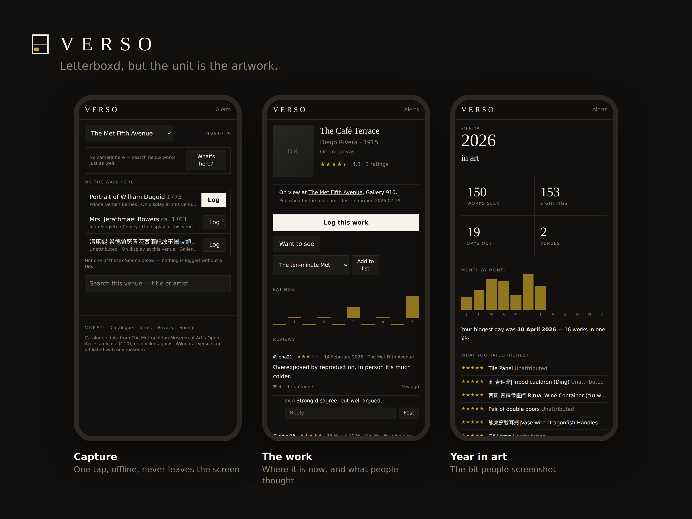
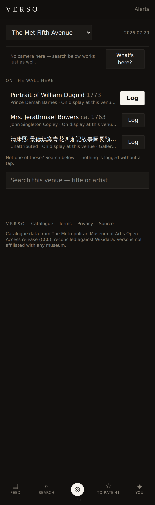
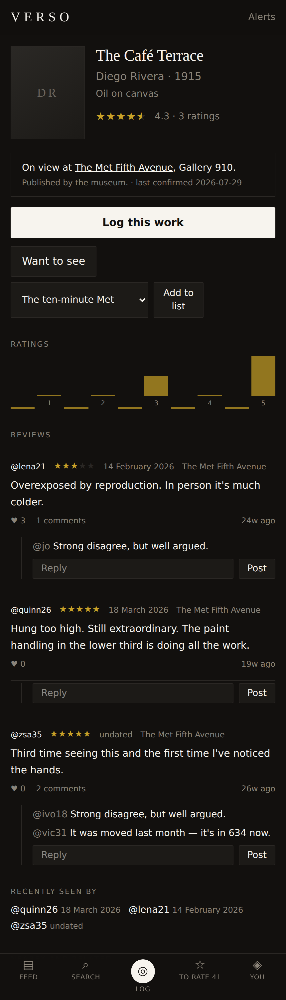
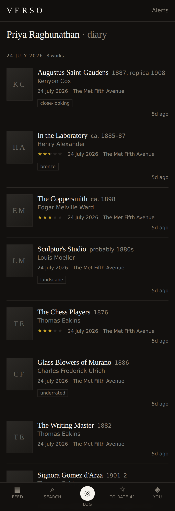
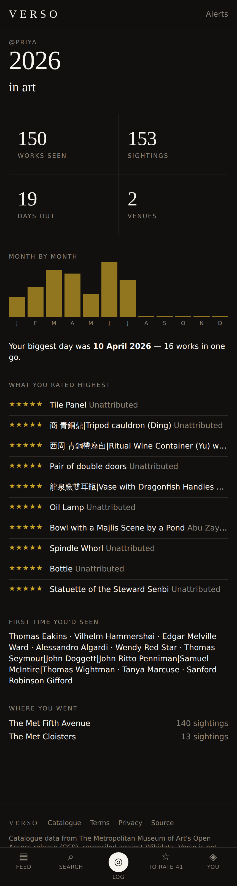
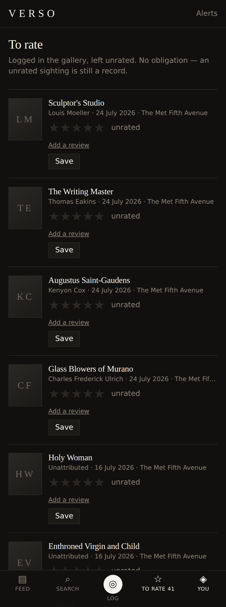
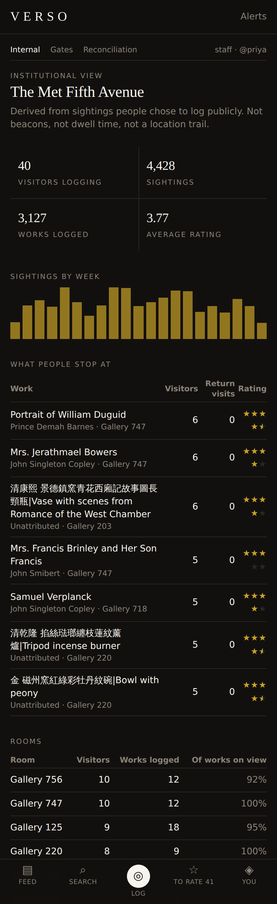

# Verso

**A diary for artworks.** Letterboxd, but the unit is an individual work — not a
film, not an exhibition, not a visit. Every painting, bronze and altarpiece you
stop in front of, with a date, a rating and a note, kept somewhere you can
search in ten years and take with you if you leave.

Built from the product requirements in [`docs/PRD.md`](docs/PRD.md), with a real
catalogue of **10,000 works currently on view at The Met**, offline-first
capture, a social layer, and the metric gates that decide whether the whole idea
is working.

```bash
git clone https://github.com/gr8monk3ys/verso && cd verso
npm install
npm run db:reset && npm run db:seed && npm run db:demo
npm run dev            # http://localhost:3000
```

Sign in as **`priya`** with password **`verso-demo`**. The catalogue seed is
committed, so nothing above touches the network.

---

## The bet

Every previous attempt at this has stalled at one city. The usual diagnosis is
execution; the more likely one is **frequency**. A film enthusiast logs 50–150
titles a year. A dedicated gallery-goer sees maybe 15 exhibitions — too few
events to form a habit, and a feed with 15 posts a year is not a feed.

So Verso logs **works, not visits**. One visit contains fifteen things worth
logging. That single decision turns ~15 events a year into plausibly 150+, and
everything else in the product follows from protecting it:

- **The capture screen never navigates away.** Log, and it re-shortlists for the
  next work. Bouncing to a confirmation page after each one is exactly how
  work-logging quietly reverts to visit-logging.
- **Rating is always deferrable.** Nobody writes criticism standing in front of
  a Rothko with a queue behind them. Log now; the evening prompt asks later.
- **Nothing waits for the network.** Gallery basements have no signal, so
  sightings are written to the device first and synced afterwards.

Whether the bet holds is a measurable question, and the app measures it rather
than assuming it — see [Metrics](#metrics).

---

## What it looks like

| | |
|---|---|
| <br>**Capture** — camera-first, one tap to log, works offline, shows what's on the wall in the room you're standing in. | <br>**The work** — where it is right now, the rating distribution, and reviews from people who stood in front of it. |
| <br>**The diary** — grouped by day, so a visit reads as a block of works rather than a single entry. | <br>**Year in Art** — the Wrapped mechanic, built to be screenshotted. |
| <br>**The evening queue** — everything logged without a rating comes back, one thumb at a time. | <br>**Institutional view** — what visitors actually stop at, under a strict anonymisation floor. |

---

## What's built

**Logging**
- Camera-first capture with alternates and one-tap confirm; never auto-logs
- Full-text catalogue search, online and offline
- Half-star ratings, free-text reviews, tags, private notes, your own photo
- Retrospective logging with explicit date precision — "some time in 2019" is a
  real answer, and renders as *2019*, not 1 January
- Reproductions logged as a distinct, labelled encounter type
- Edit or delete any sighting; every sighting has a permalink

**Social**
- Follows and an activity feed that floats reviews above bare logs
- Public work pages: aggregate rating, distribution, popular reviews
- Likes, comments, public lists, watchlist with an on-display alert
- Exhibition pages with a sightings roll-up
- Block and report, with a staff moderation queue

**Yours**
- CSV and JSON export from day one, carrying Wikidata and accession identifiers
- Account deletion that actually deletes
- Private diaries and per-sighting privacy
- Password reset, password change

**Behind the scenes**
- Catalogue ingest from The Met and the Art Institute of Chicago
- Wikidata reconciliation with a human review queue
- Crowdsourced "on view" inference — sightings become display evidence
- Live metric gates, and a catalogue guardrail measured against real ground truth
- CSP with per-request nonces, hourly backups with a rehearsed restore, and a
  preflight check that refuses to call an unready deployment ready
- Institutional analytics under a k-anonymity floor

---

## Is there an iOS or Android app?

**Not a native one.** Verso is a mobile-first **installable PWA**: on iOS, Share
→ *Add to Home Screen*; on Android, the browser offers *Install*. You get a
standalone window with no browser chrome, the app icon on the home screen, home
screen shortcuts straight to *Log* and *To rate*, and the camera and offline
queue both work.

That is the right first step and an honest description of where it stops:

| | PWA today | Native (not built) |
|---|---|---|
| Home-screen icon, standalone window | Yes | Yes |
| Camera capture | Yes | Yes |
| Works offline, syncs later | Yes | Yes |
| In the App Store / Play Store | **No** | Yes |
| Push notifications on iOS | Limited | Yes |
| Background sync | **No** | Yes |
| Share-sheet target ("share photo to Verso") | **No** | Yes |

The route to stores is a [Capacitor](https://capacitorjs.com/) wrapper around
this same app — it needs no rewrite, because the offline queue and the camera
path are already client-side. That is a deliberate follow-up, not a claim; see
[`docs/ROADMAP.md`](docs/ROADMAP.md).

---

## The catalogue is real

Not a fixture, not a Kaggle dump. `scripts/ingest/met.mjs` streams The Met's
CC0 `MetObjects.csv` (318 MB, ~500k objects) and keeps the works with a
**Gallery Number** — a field the Met populates only when an object is physically
on the wall.

| | |
|---|---|
| Works in the launch catalogue | **10,000**, all currently on view |
| Reconciled to a Wikidata Q-number | **99.7%** |
| Public domain | 86% |
| Committed seed size | 908 KB gzipped |

That gallery field is also the closest thing anyone publishes to a
machine-readable "what is on the wall today" feed — the single biggest gap in
this market — and it bootstraps the on-view dataset that visitors' sightings
then maintain.

Full detail on sources, reconciliation thresholds and the image-rights position:
[`docs/DATA.md`](docs/DATA.md).

---

## Metrics

Verso ships with the decision thresholds from the PRD computed live, at
`/internal/metrics` and on the command line:

```bash
npm run metrics
```

Two kinds of number, kept apart on purpose.

**The V0 and V1 gates describe users, and there are none.** On a seeded database
they are computed from the personas in `scripts/lib/demo.mjs`, which are tuned to
clear these thresholds — so `npm run metrics` prints a `GENERATED DATA` banner
above them and the JSON carries `"dataset": "demo"`. They verify that the
instrument works. They are not evidence about a product.

**The guardrail describes the catalogue, and that is real.** The Met publishes its
own Wikidata Q-number for each object, so the reconciler can be graded against
ground truth: run it over real works, ask live Wikidata for candidates, and
compare what it committed to against what the museum says.

```bash
npm run eval:catalogue          # live, a few minutes against WDQS
npm run eval:catalogue:replay   # regrade the committed run, no network
```

The result is committed to `data/eval/reconciliation.json` — a guardrail is only a
guardrail if it is present on a fresh clone — and `npm run metrics` gates on it.
An **unmeasured** guardrail fails rather than passing quietly: absence of evidence
must not read as evidence.

Recognition acceptance still gets reported, below the gates, labelled as
telemetry. It used to be the guardrail, which was a mistake: it is computed from
`recognition_events`, and on demo data those come from a hardcoded acceptance rate
in the seeder, so the check could not fail. It becomes meaningful the day real
people are tapping suggestions.

---

## Design

Quiet, typographic, and out of the way of the work — a wall label, not a social
network. Ink `#12100e`, paper `#f7f4ee`, one accent gold `#c9a227` used
sparingly for ratings and the label in the logo.

The mark is a canvas seen from the *verso*: the stretcher frame, its cross
brace, and the provenance label pasted in the corner. That label — the record on
the back of the work, saying where it has been and who has seen it — is the
product, so it is the one element in gold.


Colours, type, logo variants and the Open Graph card system:
[`docs/BRAND.md`](docs/BRAND.md).

---

## Architecture

Next.js 15 (App Router) · React 19 · TypeScript · Tailwind 4 · SQLite via
`node:sqlite`. No ORM, no native modules, no build step for the scripts.

```
src/lib/db/schema.sql        the object model
src/lib/domain/*.ts          typed query layer (server-only)
src/lib/domain/*.mjs         logic shared by the app, the scripts and the tests
src/lib/offline/queue.ts     IndexedDB sighting queue + venue catalogue cache
src/lib/recognition/         provider interface; no-model default
src/lib/og.tsx               Open Graph card generator
scripts/ingest/              Met, AIC, Wikidata reconciliation
tests/                       node:test, in-memory databases, no mocks
```

**Why some modules are `.mjs`.** Anything the ingest scripts, the app and the
tests all need — sighting writes, display inference, metric definitions, text
matching, the anonymisation policy — is plain JS taking a database handle. One
implementation, no build step between the CLI and the server, and the tests
drive the real code path rather than a copy of it.

**Recognition is behind an interface** and defaults to no model at all:
`gallery-prior` shortlists what is on the wall in the room you're in and says
so, rather than implying a match. Set `VERSO_RECOGNITION=http` and
`VERSO_RECOGNITION_URL` to plug in a real one. Whichever is active: always show
alternates, never write a sighting without an explicit tap, and record what was
offered against what was chosen — which is what makes the guardrail a
measurement rather than a claim.

---

## Commands

| | |
|---|---|
| `npm run dev` / `build` / `start` | the app |
| `npm test` | 102 tests, no network, no fixtures on disk |
| `npm run check` | typecheck + tests + build |
| `npm run verify` | `check` plus a seeded database and the metric gates |
| `npm run db:reset` / `db:seed` / `db:demo` | database lifecycle |
| `npm run ingest:met` / `ingest:aic` / `reconcile` | catalogue pipeline |
| `npm run metrics` | the gates |
| `npm run preflight` | is this safe to put strangers on? |
| `npm run backup` / `backup:verify` / `backup:drill` | snapshot, checksum, rehearse a restore |

---

## Deployment

```bash
VERSO_DB_PATH=/var/lib/verso/verso.db \
VERSO_MEDIA_DIR=/var/lib/verso/media \
VERSO_BASE_URL=https://verso.example \
VERSO_STAFF_BOOTSTRAP=your-handle \
NODE_ENV=production npm run build && npm start
```

**Run `npm run preflight` first.** It checks the things that are fine on a laptop
and lose users in production — mail that goes nowhere, no offsite backup, a demo
dataset, a non-https origin — and exits non-zero if any of them would block a
launch. `--send-test you@example.com` puts a real message through the configured
transport, because a mail seam that has never delivered anything is not configured,
it is merely set.

```
Verso preflight · NODE_ENV=production

  ✗ mail            reset links go to the server log; a user who forgets their
                    password is locked out until an operator reads it
  ✗ backups         no offsite copy. The sightings and the on-view record cannot
                    be rebuilt from anything
  ...
  4 blocking issues. Not ready for strangers.
```

| Variable | Purpose |
|---|---|
| `VERSO_DB_PATH` | SQLite file (default `data/verso.db`) |
| `VERSO_MEDIA_DIR` | Uploaded sighting photos (default `data/media`) |
| `VERSO_BASE_URL` | Absolute origin — used in sitemaps, share cards, reset links |
| `VERSO_STAFF_BOOTSTRAP` | Handle promoted to staff on boot; the only way to reach `/internal` on a fresh deploy |
| `VERSO_MAIL` | `log` (default), `webhook`, or `none` |
| `VERSO_MAIL_WEBHOOK` | POST target for outbound mail — Postmark, Resend, an SMTP bridge |
| `VERSO_RECOGNITION` | `gallery-prior` (default), `http`, `none` |
| `VERSO_ERROR_REPORTING` | `log` (default) or `webhook` |
| `VERSO_ERROR_WEBHOOK` | POST target for server errors — Slack, Sentry relay, your own ingest |
| `VERSO_BACKUP_DIR` | Where snapshots are written (default `data/backups`) |
| `VERSO_BACKUP_HOOK` | Command run with the backup directory — the offsite copy |

### Backups

The catalogue rebuilds from The Met in fifteen seconds. The sightings, and the
on-view record derived from them, rebuild from nothing.

```bash
npm run backup          # VACUUM INTO snapshot + photos + checksummed manifest
npm run backup:verify   # re-checksum the newest one
npm run backup:drill    # restore it somewhere harmless and check the row counts
```

`VACUUM INTO` rather than copying the file: under WAL a `cp` of `verso.db` can
catch a torn state with committed transactions still in the `-wal`. Snapshots
carry row counts and a SHA-256, and `restore` refuses a snapshot whose checksum
does not match rather than overwriting a working database with a broken one.

Hourly, with the offsite copy that makes it a backup rather than a second copy on
the same failing disk:

```
0 * * * * cd /srv/verso && VERSO_BACKUP_HOOK=/srv/verso/offsite.sh node scripts/backup.mjs
```

**Run `npm run backup:drill` on a schedule too.** A backup nobody has restored is
a rumour.

`/api/health` returns 200 with the catalogue size, or 503 when the database is
unreachable — point the load balancer at that rather than at `/`.

**Back up `data/`.** The catalogue can be rebuilt from The Met in fifteen
seconds; the sightings cannot be rebuilt from anything. WAL mode means
`sqlite3 verso.db ".backup ..."` rather than a file copy.

---

## What isn't built

Honestly, and in one place: [`docs/ROADMAP.md`](docs/ROADMAP.md). The headlines
are no native apps, no Content-Security-Policy, no real recognition model, no
email beyond password reset, exhibitions are demo data, and SQLite is right for
this scale and wrong for a real launch.

---

## Documentation

| | |
|---|---|
| [`docs/PRD.md`](docs/PRD.md) | The product requirements this was built from |
| [`docs/DECISIONS.md`](docs/DECISIONS.md) | What was decided where the PRD left a question open, and what would change it |
| [`docs/DATA.md`](docs/DATA.md) | Sources, reconciliation, the on-view problem, image rights |
| [`docs/BRAND.md`](docs/BRAND.md) | Colour, type, logo, share cards |
| [`docs/ROADMAP.md`](docs/ROADMAP.md) | What isn't built, in priority order |

---

## Licence

GPL-3.0-or-later. Catalogue metadata is CC0 from The Metropolitan Museum of
Art's Open Access initiative and the Art Institute of Chicago. Verso is not
affiliated with any museum.
